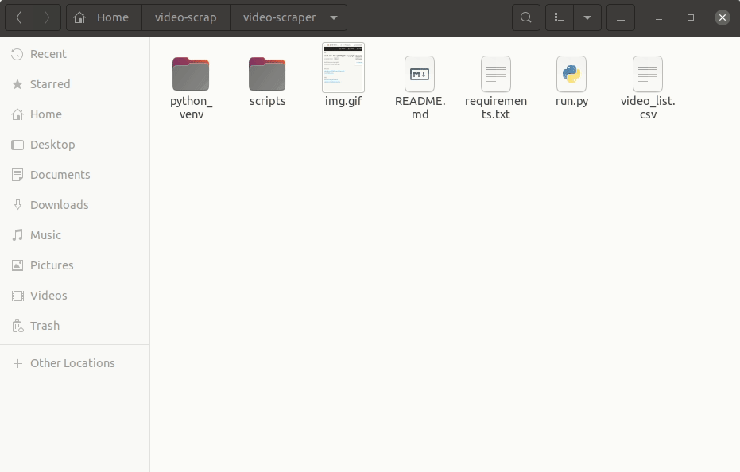
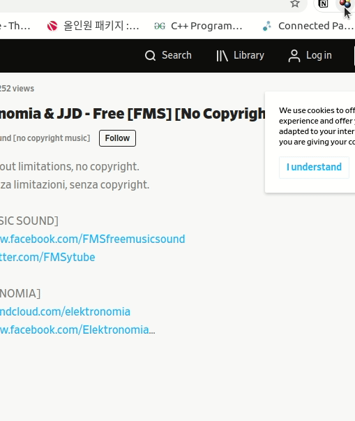

# video-scraper

## Table of contents

- [Features](#features)
- [Example uses](#example-uses)
- [How to use](#how-to-use)
- [Downloading video from unsupported websites](#downloading-video-from-unsupported-websites)
- [License / Legal issues](#license--legal-issues)

## Features

- **Video downloader with just a single command**.
  - [youtube-dl](https://github.com/ytdl-org/youtube-dl) is used to download videos
  - A .csv file is used to manage what videos to download.

## Example uses

- Downloading lecture videos from Youtube
- Downloading music videos from Youtube
- Downloading presentation videos from online academic conferences

## How to use

> Works for Windows / MacOS / Linux! :smile_cat:
> 
> If you are using Windows (or using `python` alias instead of `python3`), use `python` command instead of `python3`

- You need [Python3](https://www.python.org/downloads/) to run this script.
- Use `git clone https://github.com/changh95/video-scraper.git` command in your terminal to clone the code.
- List up the videos you wish to download in the **video_list.csv** file.
  - The first column is the **names of the videos**.
    - If you are downloading videos from the officially supported websites by [youtube-dl](https://github.com/ytdl-org/youtube-dl), then this field won't matter at all.
    - If you are downloading videos from any other websites, you'll need to fill in the video names.
  - The second column is the **streaming url**.
    - If you are downloading videos from the officially supported websites by [youtube-dl](https://github.com/ytdl-org/youtube-dl), just copy and paste the url from the browser.
    - If you are downloading videos from any other websites, you'll need to type in the streaming url. If you are not sure how to get this, refer to the 'Tips' section below.
- Run `python3 ./run.py --setup` if you are running the script for the first time.
  - This downloads the necessary softwares.
- For any uses after that, just simply use `python3 ./main.py`.

## Downloading video from unsupported websites

- If you are downloading a video from a website that is not officially supported by [youtube-dl](https://github.com/ytdl-org/youtube-dl)...
  - Get the streaming url by using [Video Downloadhelper](https://chrome.google.com/webstore/detail/video-downloadhelper/lmjnegcaeklhafolokijcfjliaokphfk?hl=ko).
  - Paste the streaming url onto the `video_list.csv`

## License / Legal issues

- I strongly recommend using this software **ONLY to download videos for PERSONAL USE**.
- I am not responsible for any legal issues caused by copyright violations.
  - For example...
    - Sharing the videos without original author's contents
    - Profitting from the videos you downloaded
    - Downloading the videos from the websites where it's not allowed.
