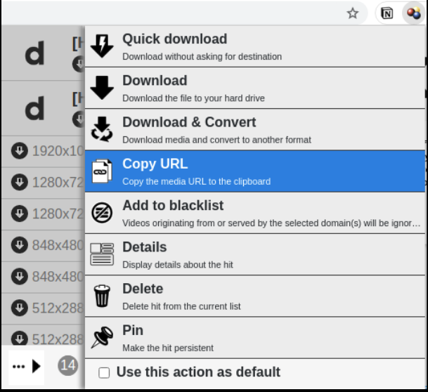

# video-scraper

## Features

- Downloads multiple videos with just a single command.
  - [youtube-dl](https://github.com/ytdl-org/youtube-dl) is used to download videos
  - A .csv file is used to manage what videos to download.

## Example uses

- Downloading lecture videos from Youtube
- Downloading music videos from Youtube
- Downloading presentation videos from online academic conferences

## License / Legal issues

- I strongly recommend using this software ONLY to download videos for PERSONAL USAGE.
- I am not responsible for any legal issues caused by copyright violations.
  - For example, 1. sharing the videos without original author's contents, 2. downloading the videos from the websites where it's not allowed.

## How to use

### Linux

- You need [Python3](https://www.python.org/downloads/) to run this script. Use `sudo apt install python3` command in your terminal to download Python3.
- Use `git clone https://github.com/changh95/video-scraper.git` command in your terminal to clone the code.
- List up the videos you wish to download in the **video_list.csv** file.
  - The first column is the **names of the videos**.
    - If you are downloading videos from the officially supported websites by [youtube-dl](https://github.com/ytdl-org/youtube-dl), then this field won't matter at all.
    - If you are downloading videos from any other websites, you'll need to fill in the video names.
  - The second column is the **streaming url**.
    - If you are downloading videos from the officially supported websites by [youtube-dl](https://github.com/ytdl-org/youtube-dl), just copy and paste the url from the browser.
    - If you are downloading videos from any other websites, you'll need to type in the streaming url. If you are not sure how to get this, refer to the 'Tips' section below.
- Run `python3 ./main.py --youtube_dl --ffmpeg` if you are running the script for the first time.
  - This downloads the necessary softwares.
  - Once you've run the command above, there is no need to use the arguments again. Just simply use `python3 ./main.py`.

### Windows

- You need [Python3](https://www.python.org/downloads/) to run this script.
  - Go to the website and follow the installation guide.
  - Make sure you add Python3 to your PATH.
- You also need [7zip](https://www.7-zip.org/).
  - Download and install this too.
- Use `git clone https://github.com/changh95/video-scraper.git` command in your terminal to clone the code.
- List up the videos you wish to download in the **video_list.csv** file.
  - The first column is the **names of the videos**.
    - If you are downloading videos from the officially supported websites by [youtube-dl](https://github.com/ytdl-org/youtube-dl), then this field won't matter at all.
    - If you are downloading videos from any other websites, you'll need to fill in the video names.
  - The second column is the **streaming url**.
    - If you are downloading videos from the officially supported websites by [youtube-dl](https://github.com/ytdl-org/youtube-dl), just copy and paste the url from the browser.
    - If you are downloading videos from any other websites, you'll need to type in the streaming url. If you are not sure how to get this, refer to the 'Tips' section below.
- In the folder, hold on to `shift` button and click right-mouse-click button. Open `Windows Powershell`.
- Run `python3 ./main.py --youtube_dl --ffmpeg` if you are running the script for the first time.
  - This downloads the necessary softwares.
  - Once you run the command above, you will see a file `ffmpeg-4.4-full_build`. Unzip this, and copy the 'ffmpeg-4.4-full_build/bin/ffmpeg.exe' to the main directory (right next to youtube-dl.exe).
- For any uses after the first time, just use `python3 ./main.py`.

## Tips

- If you are downloading a video from a website that is not officially supported by [youtube-dl](https://github.com/ytdl-org/youtube-dl)...
  - Get the streaming url by using [Video Downloadhelper](https://chrome.google.com/webstore/detail/video-downloadhelper/lmjnegcaeklhafolokijcfjliaokphfk?hl=ko).
  - Paste the streaming url onto the `video_list.csv`

