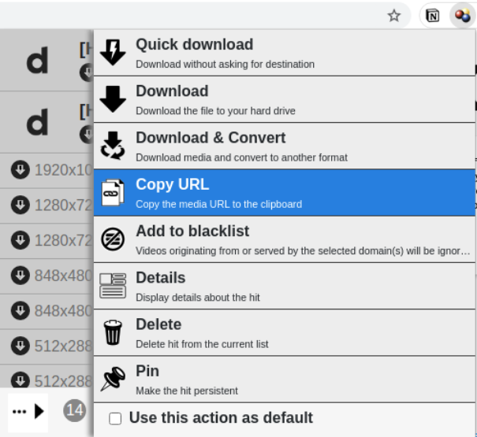

# video-scraper

## Features

- Uses [youtube-dl](https://github.com/ytdl-org/youtube-dl) to download videos
- Uses a .csv file to download videos in batch, instead of manual CLI typing for individual downloading.

## How to use

- You need [Python3](https://www.python.org/downloads/) added in your PATH variable.
  - For Linux, use `sudo apt install python3` in your terminal.
  - For Windows, follow the website guidance.
- Clone the repo.
- Update the `video_list.csv`.
  - The first column is the **name of the video**. If the streaming website is supported by [youtube-dl](https://github.com/ytdl-org/youtube-dl), then this field does not matter. If not, then the downloaded video file name will be replaced to this name.
  - The second column is the **streaming url**. Copy and paste from your browser. If the website is not supported by [youtube-dl](https://github.com/ytdl-org/youtube-dl), refer to the 'Tips' section below.

## Tips

- If you are downloading a video from a website that is not officially supported by [youtube-dl](https://github.com/ytdl-org/youtube-dl)...
  - Get the streaming url by using [Video Downloadhelper](https://chrome.google.com/webstore/detail/video-downloadhelper/lmjnegcaeklhafolokijcfjliaokphfk?hl=ko).
  - Paste the streaming url onto the `video_list.csv`

